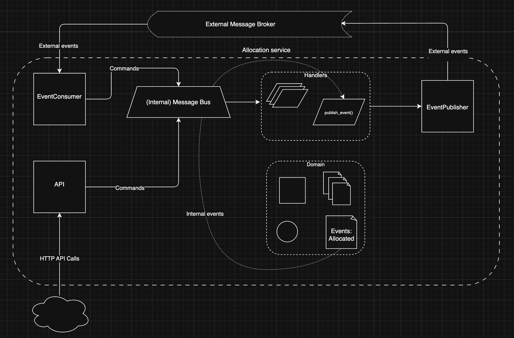

# Architecture Patterns with Python

This repository is a showcase of architectural patterns widely used in industrial projects.
We start from a simple e-commerce use case: the business decides to implement an exciting new way of allocating stock. Instead of just considering goods available in the warehouse, we will treat the goods on ships as real stock and part of our inventory, just with slightly longer lead times. Fewer goods will appear to be out of stock, we’ll sell more, and the business can save money by keeping lower inventory in the domestic warehouse.

## Introduction

For that purpose, we start with a simple architecture with:

- **domain model**: Contains the core model of our domain (with just order lines and batches). Here we define value objects and entities to structure the concepts we work with
- **repository**: This layer enables interaction with storage. We also implement an ORM
- **service layer**: This is the part that orchestrates the steps when we have to perform an operation like allocation

Then to have the most consistent interactions with our database, we introduce:

- **unit of work**: This helps provide an abstraction over atomic operations
- **aggregates**: Evolution of our models so that we can have concurrent operations given a cluster of associated objects

We then evolve our application so that it becomes a message processor, easier to integrate in an architecture with microservices. We introduce:

- **Events**: Broadcast by an actor to all interested listeners. Events capture facts
- **Commands**: Instructions sent by one part of a system to another. Commands capture intent
- **Command-Query Responsibility Segregation**: Basically, we start from the insight that most users are not going to buy, but just browse the product. In our application we need to separate read and write queries, so we introduce a module for views only used to read our products

## Prerequisites

Make sure you have:

- [uv](https://docs.astral.sh/uv/): Python package and project manager ([instructions](https://docs.astral.sh/uv/getting-started/installation/))
- [Docker](https://www.docker.com/get-started/) or a docker container manager (use [colima](https://github.com/abiosoft/colima#installation) for macOS)
- [dbeaver](https://dbeaver.io/) optional database tool to manage your database


The tech stack used:

- [FastAPI](https://fastapi.tiangolo.com/) as our backend
- [Postgres](https://www.postgresql.org/) as our database
- [Pulsar](https://pulsar.apache.org/) as our message broker


## Setup local env

```sh
make start-dev
```

This will spin up the dev environment in docker, and run a FastAPI locally that connects to docker.
Head to `http://127.0.0.1:8000/docs` for the swagger documentation, and perform some tests.

You can stop the dev env with:

```sh
make stop-dev
```

## Run tests

To run all tests, you can use:

```sh
make tests
```

## Architecture



## Project structure

```text
.
├── docker-compose.yml
├── Dockerfile
├── Makefile       <-- Commands to build, test and run locally the project
├── pyproject.toml <-- Build configuration file used for build and packaging tools
├── README.md
├── src
│   └── allocation
│       ├── __init__.py
│       ├── entrypoints                 <-- Main script to run the application
│       │   ├── fast_app.py             <-- Entrypoint to run a REST API
│       │   └── eventconsumer.py        <-- Entrypoint to run an event consumer
│       ├── service_layer               <-- Orchestration layer
│       │   ├── __init__.py
│       │   ├── handlers.py             <-- Set of handlers to process commands and events
│       │   ├── messagebus.py           <-- Orchestrator class that processes events and commands then handles persistence
│       │   └── unit_of_work.py         <-- Manage context over atomic operations to the database
│       ├── adapters
│       │   ├── __init__.py
│       │   ├── email.py                <-- Email module to send email when needed
│       │   ├── notifications.py        <-- Notification interface and classes used to produce notifications when needed
│       │   ├── orm.py                  <-- Actual definition of database tables and mappings to our objects
│       │   ├── eventpublisher.py       <-- Event publisher
│       │   └── repository.py           <-- Actual layer to handle persistence
│       ├── domain
│       │   ├── __init__.py
│       │   ├── commands.py             <-- Command definitions
│       │   ├── events.py               <-- Event definitions
│       │   └── model.py                <-- Model definitions
│       ├── bootstrap.py                <-- Dependencies initialization and bootstrapping
│       ├── config.py
│       └── logger.py
├── tests
│   ├── __init__.py
│   ├── conftest.py
│   ├── e2e
│   ├── integration
│   └── unit
└── uv.lock
```
